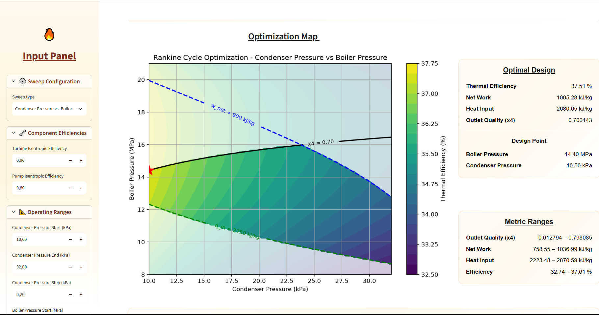

# Grid-Based Optimization Mapping of a Rankine Cycle

## Screenshot



This project is an interactive Python tool for analyzing and optimizing a simple Rankine cycle using grid-based parametric sweeps. The tool evaluates cycle performance over a selected design space, applies engineering constraints, and identifies the optimum feasible operating point according to a user-defined objective function.

The project includes both a computational backend and a Streamlit-based graphical user interface.

## Project Overview

In practical Rankine cycle design, the best operating point is not determined only by maximum thermal efficiency. Other engineering considerations, such as turbine outlet quality, net work output, and heat input requirement, must also be considered.

This tool helps visualize these trade-offs by generating optimization maps for different combinations of operating parameters.

## Features

- Simple Rankine cycle analysis
- Thermodynamic property evaluation using CoolProp
- Grid-based two-variable parametric sweeps
- Engineering constraint handling
- Objective function comparison
- Interactive Streamlit graphical user interface
- Optimization map visualization
- Feasible and infeasible design region separation

## Available Sweep Modes

The tool supports the following two-variable sweep modes:

1. Boiler pressure vs. turbine inlet temperature  
2. Condenser pressure vs. turbine inlet temperature  
3. Condenser pressure vs. boiler pressure  

## Objective Functions

The user can select one of the following objective functions:

- Maximize thermal efficiency
- Maximize net work output
- Minimize heat input
- Maximize turbine outlet quality

## Engineering Constraints

The following constraints can be applied:

- Minimum turbine outlet quality
- Minimum net work output
- Maximum heat input
- Minimum thermal efficiency

Design points that violate one or more selected constraints are excluded from the optimum point selection.

## Thermodynamic Model

The model is based on a simple Rankine cycle with four main states:

1. Saturated liquid at the condenser outlet  
2. Compressed liquid at the boiler inlet  
3. Superheated vapor at the turbine inlet  
4. Turbine outlet state  

The main performance parameters are:

- Pump work
- Turbine work
- Net work output
- Heat input
- Thermal efficiency
- Turbine outlet quality

## Tools and Libraries

- Python
- Streamlit
- CoolProp
- NumPy
- Matplotlib

## How to Run

First, install the required Python packages:

```bash
pip install -r requirements.txt

```
Then run the Streamlit application:

```bash
streamlit run app.py
```

## Project Structure

```text
rankine-cycle-optimization-tool/
│
├── app.py
├── rankine_backend.py
├── requirements.txt
├── README.md
│
├── report/
│   └── rankine_cycle_optimization_report.pdf
│
└── figures/
    ├── gui_screenshot.png
    ├── boiler_pressure_temperature_unconstrained.pdf
    ├── boiler_pressure_temperature_constrained.pdf
    ├── condenser_boiler_low_temperature.pdf
    ├── condenser_boiler_high_temperature.pdf
    ├── condenser_boiler_high_temperature_constrained.pdf
    └── objective_function_comparison_map.pdf
```

## Example Results

The tool demonstrates that the optimum Rankine cycle operating point depends strongly on the selected constraints and objective function. For example, maximizing thermal efficiency, maximizing net work output, minimizing heat input, and maximizing turbine outlet quality can lead to different optimum design points within the same feasible design space.

This shows that Rankine cycle optimization involves trade-offs between efficiency, work output, heat input, and turbine outlet quality.

## Report

A detailed project report is included in the `report/` folder:

```text
report/rankine_cycle_optimization_report.pdf
```

The report explains the thermodynamic model, software implementation, optimization methodology, graphical user interface, results, and possible future developments.

## Future Developments

Possible future improvements include:

- Reheat Rankine cycle modeling
- Regenerative feedwater heating
- Exergy analysis
- Economic analysis
- More advanced optimization algorithms

## Author

Kaan Karabakal  
Department of Mechanical Engineering  
Middle East Technical University
